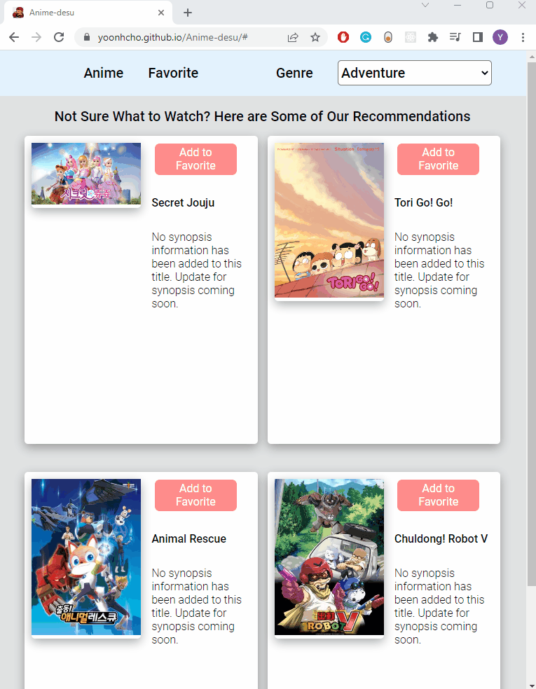

# Anime-desu

### A web application for Anime beginners who wants to get Anime recommendations

Although I do not watch Animes so much now, I decided to create this app since
I used to enjoy watching when I was younger. I thought looking at the pictures and
reading the synopsis of the Anime will bring back memories and thus I will enjoy
working on my first Project. I also wish the users of this app to get additional
information of different Animes and enjoy using it as much as I enjoyed creating the app.

### Link to App and short sample of the app
[To view my app Anime-desu](https://yoonhcho.github.io/Anime-desu/)

### Technologies Used
* Used **Javascript** to manipulate the webpage behavior, **HTML** and **CSS**
  to determine the structure and the style of the webpage
* Designed sitemap using **Figma**'s wireframing tools
* implemented Mobile first design using **CSS media queries** and **Flexbox** layout
* Utilized **JSON** to store and retrieve data from previous sessions
* Requested data from public API [Jikan API](https://docs.api.jikan.moe/) and
  implemented **AJAX** and querying the **DOM** for rendering to display the query
  result for images and synopses.

### Features in the App
* User can view random Anime movies/series recommendations
* User can serach for Anime based on genre
* User can see the synopsis of each Anime
* User can add Animes to favorites
* User can view their favorite Animes
